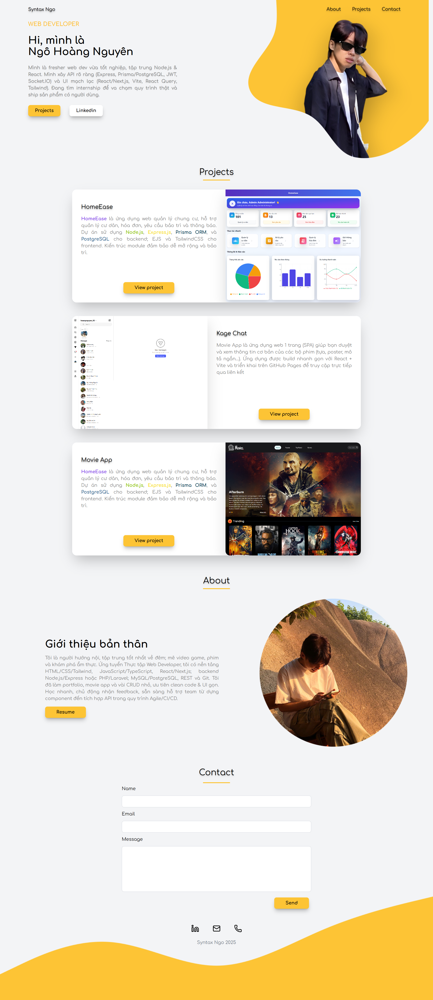
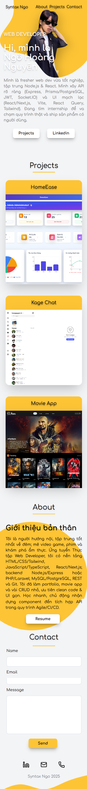

<div align="center">

# 🌟 Portfolio - Syntax Ngo

[](https://tynkeyrm0511.github.io/portfolio/)
[](https://tailwindcss.com/)
[](LICENSE)

**Portfolio cá nhân hiện đại, responsive**

[🚀 Xem Demo](https://tynkeyrm0511.github.io/portfolio/) · [🐛 Báo lỗi](https://github.com/tynkeyrm0511/portfolio/issues) · [💡 Đề xuất tính năng](https://github.com/tynkeyrm0511/portfolio/issues)

</div>

---

## 📸 Demo Screenshot

<div align="center">
  <table>
    <tr>
      <td width="60%">
        
        <p align="center"><b>💻 Desktop View</b></p>
      </td>
      <td width="40%">
        
        <p align="center"><b>📱 Mobile View</b></p>
      </td>
    </tr>
  </table>
</div>

---

## 📖 Giới thiệu

Portfolio cá nhân được xây dựng với **HTML**, **TailwindCSS** và các thư viện hiện đại. Giao diện tối ưu cho **mobile** và **desktop**, với hiệu ứng mượt mà, clean code và dễ tùy chỉnh.

> 🎯 **Mục tiêu:** Giới thiệu bản thân, showcase các dự án nổi bật và tạo ấn tượng với nhà tuyển dụng.

---

## ✨ Tính năng nổi bật

- 📱 **Responsive Design** - Tối ưu cho mobile & desktop *(chưa hỗ trợ tablet)*
- 🎨 **Hiệu ứng động mượt mà** - AOS animations & TailwindCSS transitions
- 🖼️ **Projects Showcase** - Bố cục đồng nhất, ảnh focus top, responsive tốt
- 📧 **Contact Form** - Form liên hệ đơn giản, dễ tích hợp backend
- 🎭 **Icon động** - Lucide Icons với hiệu ứng hover đẹp mắt
- 🌊 **SVG Background** - Footer với wave effect, tối ưu mọi màn hình
- ⚡ **Fast Loading** - Tối ưu hình ảnh và CSS

---

## 🛠️ Công nghệ sử dụng

<div align="center">

[](https://tailwindcss.com/)
[](https://michalsnik.github.io/aos/)
[](https://lucide.dev/)
[](https://developer.mozilla.org/en-US/docs/Web/HTML)
[](https://developer.mozilla.org/en-US/docs/Web/CSS)

</div>

---

## 🚀 Cách sử dụng

### 1️⃣ Clone repo

```bash
git clone https://github.com/tynkeyrm0511/portfolio.git
cd portfolio
```

### 2️⃣ Cài đặt dependencies

```bash
npm install
```

### 3️⃣ Chạy development mode

```bash
npm run dev
```

### 4️⃣ Build cho production

```bash
npm run build
```

### 5️⃣ Mở file HTML

```bash
# Hoặc mở trực tiếp file index.html trên trình duyệt
```

---

## 🌐 Deploy lên GitHub Pages

1. **Build CSS:**
   ```bash
   npm run build
   ```

2. **Commit và push:**
   ```bash
   git add .
   git commit -m "Build for production"
   git push origin main
   ```

3. **Cấu hình GitHub Pages:**
   - Vào repo > **Settings** > **Pages**
   - Chọn branch `main` và folder `/` (root)
   - Nhấn **Save**

4. **Lưu ý:**
   - Đảm bảo đường dẫn ảnh và CSS là **relative** (`assets/...`, `css/...`, `dist/...`)
   - File `dist/output.css` phải được commit lên repo (không ignore)

---

## 📂 Cấu trúc thư mục

```
portfolio/
├── assets/              # Hình ảnh, icon
│   ├── screenshot-desktop.png
│   ├── screenshot-mobile.png
│   ├── portrait_1.png
│   └── ...
├── css/                 # CSS tùy chỉnh
│   └── main.css
├── dist/                # TailwindCSS output
│   └── output.css
├── js/                  # JavaScript
│   └── main.js
├── index.html           # Trang chủ
├── package.json         # Dependencies
├── tailwind.config.js   # TailwindCSS config
└── README.md            # File này
```

---

## 🎨 Tùy chỉnh

### Màu sắc

Sửa file `tailwind.config.js`:

```js
module.exports = {
  theme: {
    extend: {
      colors: {
        p: '#FDC435',      // Màu chủ đạo
        text: '#333333',   // Màu chữ
      }
    }
  }
}
```

### Font chữ

Thêm font vào `index.html` và cấu hình trong `tailwind.config.js`:

```js
fontFamily: {
  comfortaa: ['Comfortaa', 'sans-serif'],
}
```

---

## 📝 License

Dự án này được phát hành dưới giấy phép **MIT License** - xem file [LICENSE](LICENSE) để biết thêm chi tiết.

---

<div align="center">

### 💌 Liên hệ

[](https://www.linkedin.com/in/nguyen-ngo-hoang-b01440361/)
[](mailto:hoangnguyen.dev2003@gmail.com)
[](https://github.com/tynkeyrm0511)

---

**Made with ❤️ by Syntax Ngo - 2025**

⭐ Nếu bạn thấy dự án này hữu ích, hãy cho mình một star nhé!

</div>